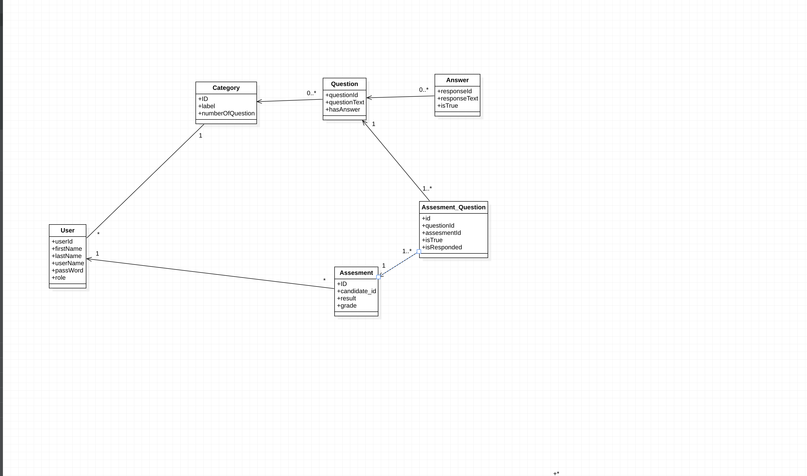

# Government Employment Eligibility Testing System

## Project Overview

This project is designed to assist the government in assessing candidates' knowledge across various domains before they are hired for government positions. The system ensures that all candidates undergo a standardized test, with strict reattempt policies and comprehensive tracking of test history.

## Problem Statement

The company intends to develop a software system to help the government evaluate candidates' knowledge in various domains prior to hiring them. All candidates must pass a test, and if they fail, they are allowed one additional attempt. If a candidate fails twice, they must wait 2 years before being eligible to retake the test. Passing and failing criteria for each domain are set by the government.

The system will maintain a large, categorized question database for each domain. During each test session, it will randomly select a specific number of questions (e.g., 10 out of 500) to ensure that each candidate receives a unique set of questions, making the process fair and reducing repetition.

## Key Features

- **Candidate Portal**: Candidates will have login access to view their performance history, upcoming test schedules, and future eligibility for exams.
- **Government Administrator Portal**: Authorized government members will be able to securely log in, view candidate results, assign successful candidates to job locations, and manage candidate records.
- **Attempt Tracking**: Candidates who have previously passed a test in a specific domain will be marked as eligible and will not need to retake the exam.

## Requirements

- **Randomized Question Selection**: Ensures each test session draws unique questions for fairness.
- **Reattempt and Eligibility Rules**: Adheres to the government’s policy on reattempts and reentry timelines for failed candidates.
- **Data Security**: Secure login access for both candidates and government members to maintain data privacy and integrity.

---
This project aims to streamline the government hiring process by ensuring only qualified candidates are selected based on standardized, fair testing methods.

## ER DIAGRAM
